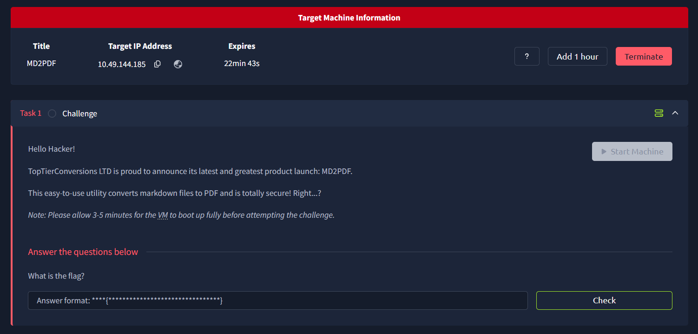
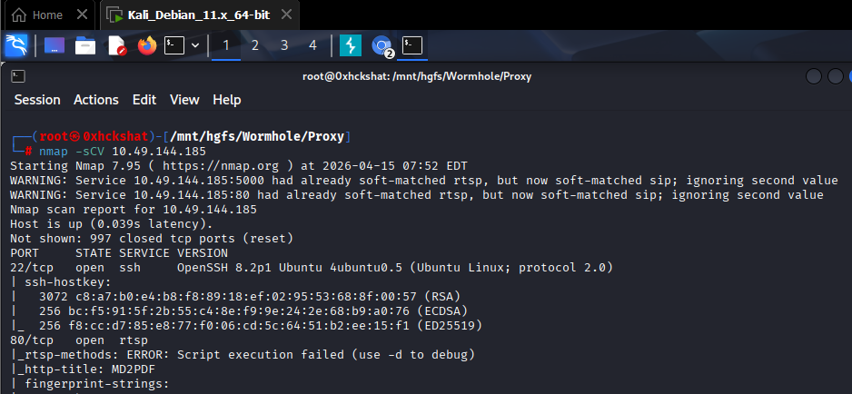
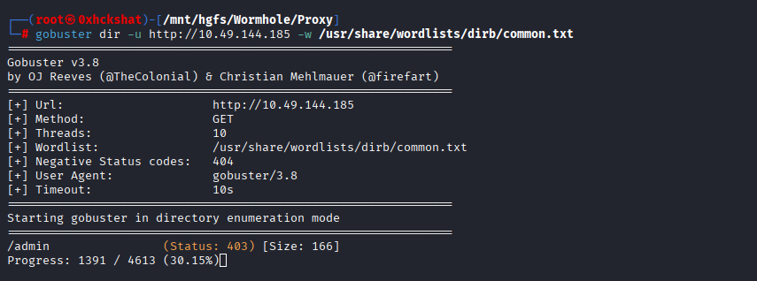
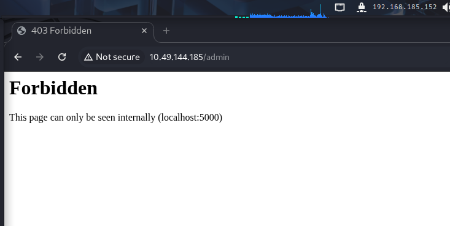
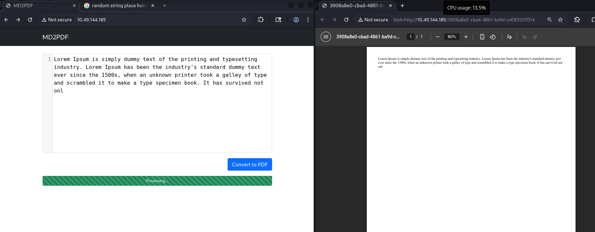
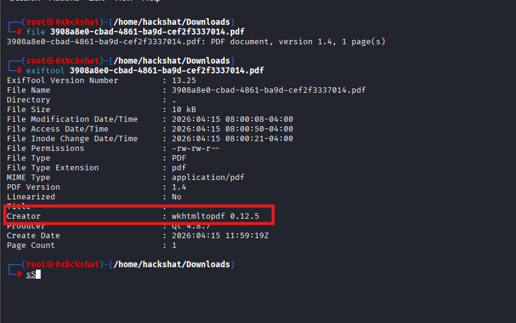
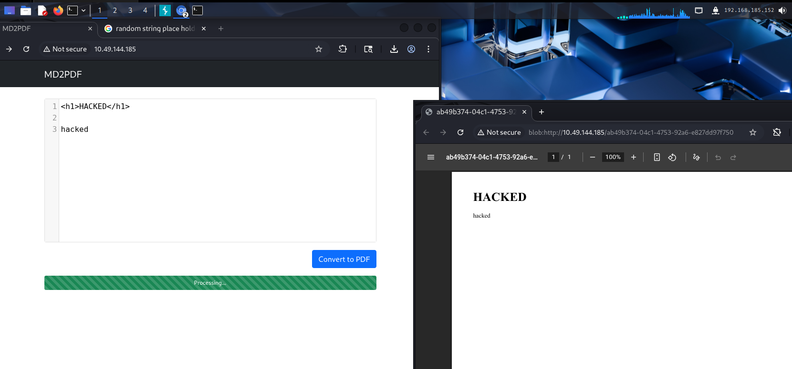
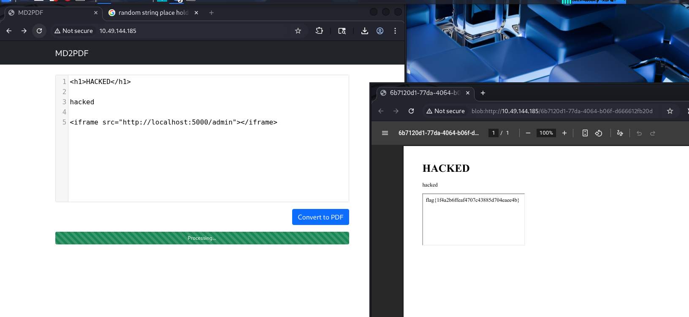

---

# 🎯 Try Hack Me CTF - MD2PDF SSRF via HTML Injection walktrough

---

# 🧩 Challenge Overview

You’re given a target machine (IP/domain).



---

# 🌐 Step 1 — Scan the Target (Nmap)

We begin with a basic scan using **Nmap**

```bash
nmap -sC -sV <target-ip>
```

---



---

### 🔍 What we find:

* Port **80** (HTTP) is open ✅
* Possibly other ports, but web is our entry point

👉 So we move to the browser:

```
http://<target-ip>
```

---

# 📂 Step 2 — Directory Bruteforce (Gobuster)

Now we enumerate hidden endpoints using **Gobuster**

```bash
gobuster dir -u http://<target-ip> -w /usr/share/wordlists/dirb/common.txt
```

---

---

### 🔍 Interesting Findings:

* `/admin` 👀
* Possibly other endpoints

---

# 🚪 Step 3 — Investigating `/admin`

Visit:

```
http://<target-ip>/admin
```

---

---

### 🔍 What we observe:

* Page shows something like:

  * ❌ Access denied
  * ❗ Only accessible from **localhost**
  * and include **port information** port 5000

---

💡 Key Insight:

> The admin panel is restricted to **localhost only**

So we need a way to:
➡️ Make the server access it *internally*

---

# 📝 Step 4 — Find the Input Functionality

Back to the main page — we discover:

👉 A form that generates a **PDF from input**

---

### 🖼️ Add this image:

---

### 🧪 Try simple inputs:

```text
hello
test123
CTF
```

👉 A PDF gets generated

---

# 🔍 Step 5 — Inspect the PDF Metadata

Download the PDF and inspect it:

Use:

```bash
exiftool file.pdf
```

---

---

### 🔍 What we learn:

* The PDF is generated using some **HTML-to-PDF converter library**

---

💡 This is HUGE:

> If input → HTML → PDF
> ➡️ We might control HTML rendering

---

# 🧠 Step 6 — Research the Converter

Search:

```
HTML to PDF converter vulnerabilities
```

👉 Many such libraries allow:

* HTML rendering
* External requests
* Script execution (sometimes)

---

💡 Conclusion:

> 🚨 This looks like an **HTML Injection vulnerability**

---

# 🧪 Step 7 — Confirm HTML Injection

Try injecting simple HTML:

```html
<h1>HACKED</h1>
```

---

---

✅ If the PDF shows **HACKED in big text**

👉 Vulnerability confirmed

---

# 💥 Step 8 — Exploit the Vulnerability

Now we weaponize it 😈

---

## 🎯 Goal:

Access:

```
http://localhost:5000/admin
```

---

### 🧠 Idea:

Make the PDF generator:
➡️ Fetch internal URL
➡️ Render it into PDF

---

## 🧪 Payload:

```html
<iframe src="http://localhost/admin"></iframe>
```

---

OR

```html

```

---

---

# 🏁 Step 9 — Capture the Flag

Now generate the PDF again…

👉 Inside the PDF:

* Admin page content appears 🎉
* And… **THE FLAG** 🏴


# 🧠 Key Takeaways

### 🔑 1. Localhost restriction ≠ secure

If server renders content → you can abuse it

---

### 🔑 2. HTML to PDF = dangerous surface

Always think:

* SSRF
* HTML Injection
* File inclusion

---

### 🔑 3. Internal services can be exposed

Using:

```html
iframe / img / embed
```

---

# ⚡ Pro Hacker Insight

This attack is a combo of:

* HTML Injection
* SSRF (Server-Side Request Forgery)

---

# 🎉 Final Thought

> 🔥 “If the server renders your input, it executes your intent.”

---
